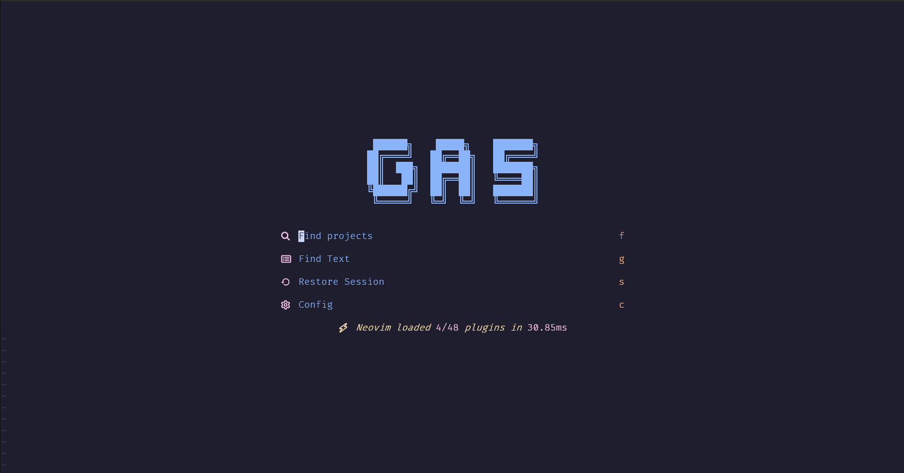
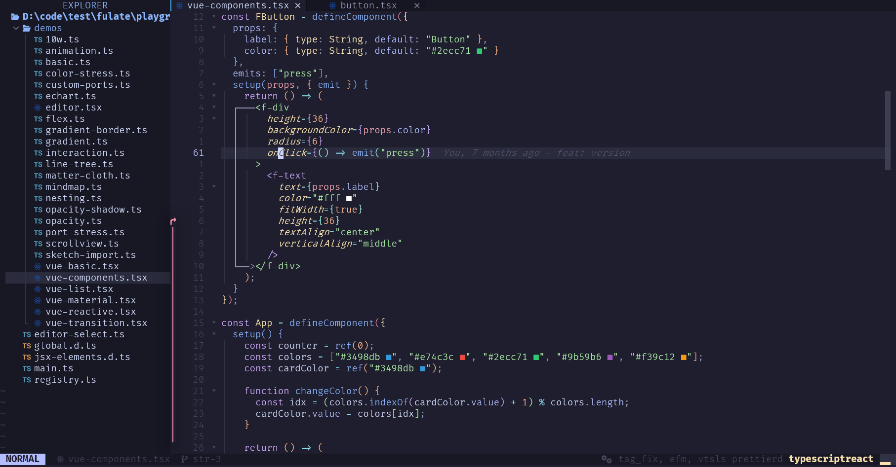
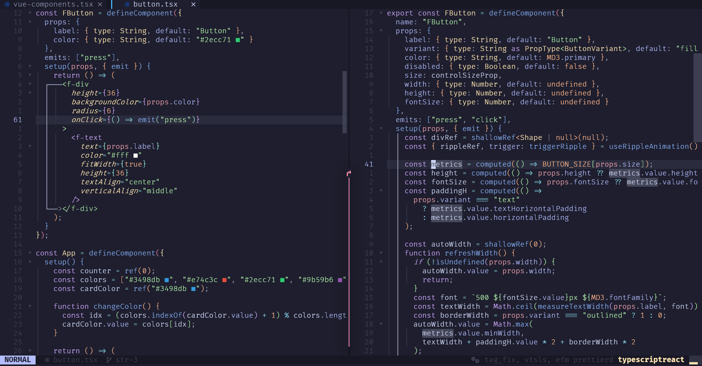
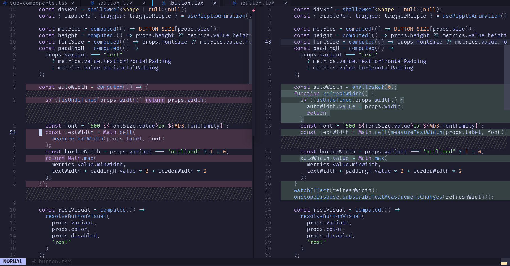
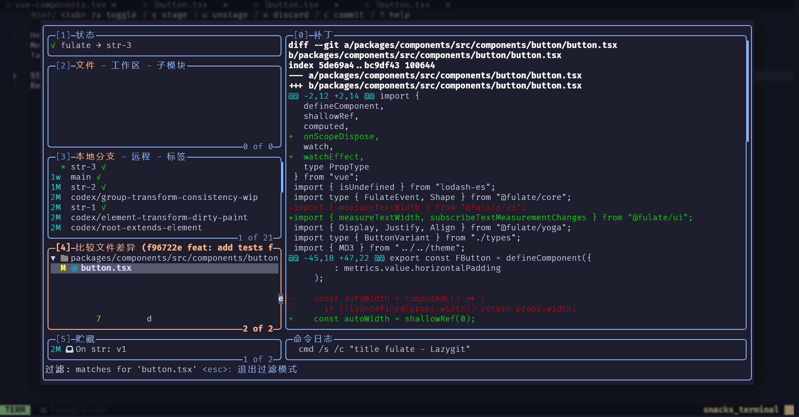
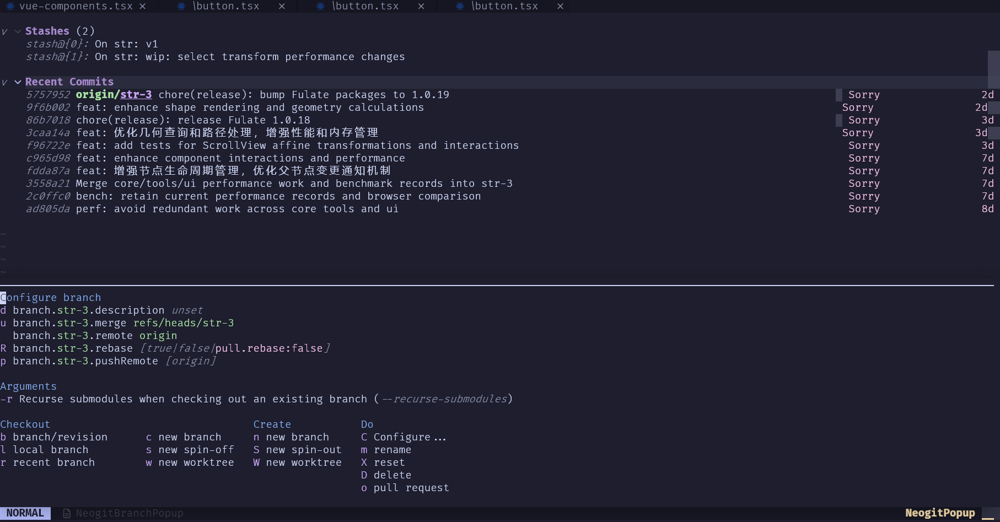
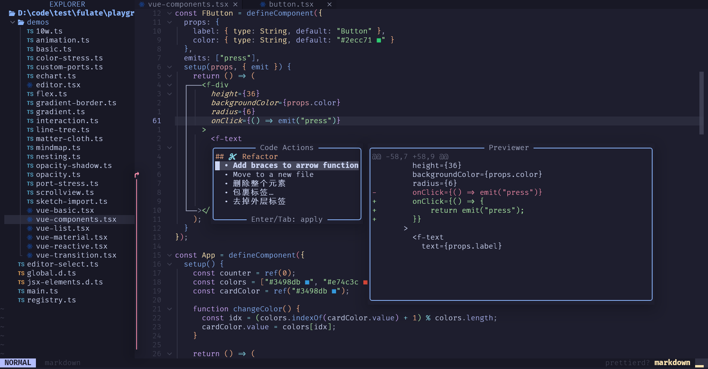
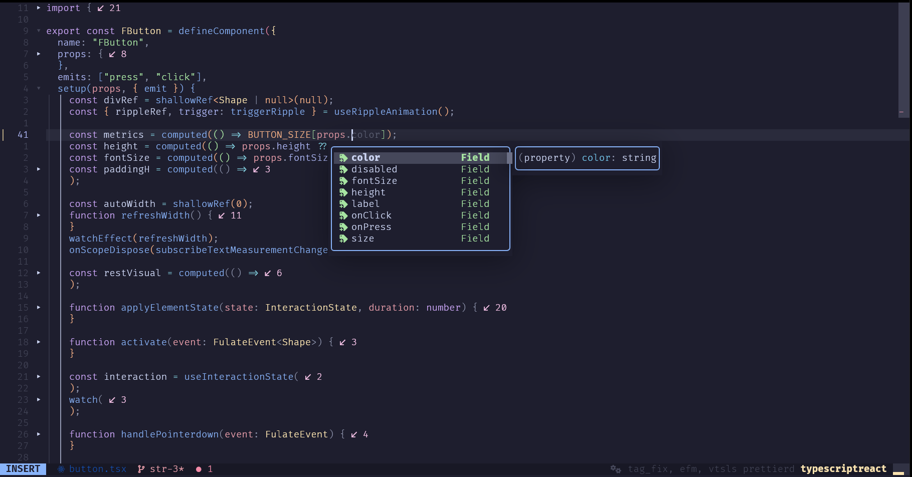

# Neovim 配置快捷键文档

## 目录

- [核心快捷键](#核心快捷键)
- [分屏操作](#分屏操作)
- [窗口导航与调整](#窗口导航与调整)
- [Buffer 管理](#buffer-管理)
- [文件树操作](#文件树操作)
- [代码编辑](#代码编辑)
- [Git 操作与差异](#git-操作与差异)
- [代码搜索与跳转](#代码搜索与跳转)
- [LSP 功能](#lsp-功能)
- [Treesitter 文本对象与跳转](#treesitter-文本对象与跳转)

---

## 核心快捷键

| 模式 | 按键 | 功能 |
|------|------|------|
| n | `<Enter>` | 进入插入模式 |
| i | `<Enter>` | 换行 |
| n | `<A-a>` | 全选 |
| n | `<Esc>` | 关闭悬浮帮助或清除搜索 |
| n | `J` | 下翻半页 |
| n | `K` | 上翻半页 |
| n | `gh` | 跳转到行首 |
| n | `gl` | 跳转到行尾 |

### 禁用按键 (使用 Alt 组合键替代)

`x` 保留字符删除，`x` / `c` / `d` 使用黑洞寄存器，不覆盖剪贴板。

| 原按键 | 替代方案 |
|--------|----------|
| `s` (替换) | `<Enter>` 进入插入模式 |
| `u` (撤销) | `<A-z>` |
| `<C-r>` (重做) | `<A-y>` |
| `dd` (删除行) | `<A-d>` |

### 撤销/重做/跳转

| 模式 | 按键 | 功能 |
|------|------|------|
| n, i, v | `<A-z>` | 撤销 |
| n, i, v | `<A-y>` | 重做 |
| n | `<A-u>` | 后退跳转位置 |
| n | `<A-i>` | 前进跳转位置 |

---

## 分屏操作

组件示例与组件实现并排查看：

| 按键 | 功能 |
|------|------|
| `<leader>wv` | 垂直分屏 |
| `<leader>ws` | 水平分屏 |

---

## 窗口导航与调整

### 窗口跳转 (Ctrl + 方向键)

| 按键 | 功能 |
|------|------|
| `<C-j>` | 跳转到下方窗口 |
| `<C-k>` | 跳转到上方窗口 |
| `<C-h>` | 跳转到左侧窗口 |
| `<C-l>` | 跳转到右侧窗口 |

### 窗口大小调整 (Alt + 方向键)

| 按键 | 功能 |
|------|------|
| `<A-Up>` | 增加窗口高度 |
| `<A-Down>` | 减少窗口高度 |
| `<A-Left>` | 减少窗口宽度 |
| `<A-Right>` | 增加窗口宽度 |

---

## Buffer 管理

| 按键 | 功能 |
|------|------|
| `<A-h>` | 上一 buffer |
| `<A-l>` | 下一 buffer |
| `<A-<>>` | buffer 左移 |
| `<A->>` | buffer 右移 |
| `<A-1>` ~ `<A-3>` | 跳转到对应 buffer |
| `<A-p>` | pin buffer (固定) |
| `<A-w>` | 智能关闭窗口 / 删除缓冲区 |

---

## 文件树操作

| 按键 | 功能 |
|------|------|
| `<A-b>` | 切换文件树 |
| `<A-e>` | 定位当前文件 |

---

## 代码编辑

### 移动行/选区

| 模式 | 按键 | 功能 |
|------|------|------|
| n | `<A-j>` | 向下移动行 |
| n | `<A-k>` | 向上移动行 |
| v | `<A-j>` | 向下移动选区 |
| v | `<A-k>` | 向上移动选区 |

### 子词跳转

`nvim-spider` 按驼峰、下划线和数字边界移动；`<leader>` 是空格，`w` 为小写，`B` / `E` 为大写；`jj` 用于 Flash，`jw` 用于子词跳转。

| 模式 | 按键 | 功能 |
|------|------|------|
| n, x, o | `<leader>jw` | 下一个子词开头 |
| n, x, o | `<leader>jB` | 上一个子词开头 |
| n, x, o | `<leader>jE` | 子词末尾 |

可用 `v<leader>jE` 选到子词末尾，或 `d<leader>jE` / `c<leader>jE` 删除 / 替换到子词末尾。

### 多光标

独立 Neovim / Neovide 使用 `vim-visual-multi` 实时同步输入；VSCode 环境使用宿主多光标及原有 `vscode-multi-cursor.nvim`。

| 模式 | 按键 | 功能 |
|------|------|------|
| n, x, i | `gb` | 首次选中当前词，再按选中下一个相同的词或选区 |
| n, x, i | `<A-J>` | 向下添加光标（Alt+Shift+J） |
| n, x, i | `<A-K>` | 向上添加光标（Alt+Shift+K） |
| n, x | `mc` | 手动创建光标；独立编辑器中再次按下可移除 |
| n, x | `mm` | 独立编辑器中启用全部光标，然后用普通移动键一起移动 |
| n, x | `mi` | 在所有光标前插入 |
| n, x | `ma` | 在所有光标后插入 |

独立编辑器中，输入、退格和换行会实时同步到其他光标。普通模式按 `<Esc>` 退出多光标；插入模式先按 `<Esc>` 返回普通模式，再按一次退出。`mc` 可逐个标记不同位置，然后用 `mm` 启用全部光标并一起移动，或用 `mi` / `ma` 开始同时编辑。多光标期间暂停补全和自动括号，退出后自动恢复。

### 删除/剪切

| 模式 | 按键 | 功能 |
|------|------|------|
| n | `<A-d>` | 删除整行 |
| v | `<A-d>` | 删除选区 |
| n | `<A-x>` | 剪切整行到剪贴板 |
| v | `<A-x>` | 剪切选区到剪贴板 |

### 复制/粘贴

| 模式 | 按键 | 功能 |
|------|------|------|
| v | `<A-c>` | 复制到系统剪贴板 |
| n, v | `<A-v>` | 粘贴 |
| i | `<A-v>` | 插入模式粘贴 |

### 保存

| 按键 | 功能 |
|------|------|
| `<A-s>` | 保存文件 |

### 注释

| 模式 | 按键 | 功能 |
|------|------|------|
| n, v | `<A-/>` | 切换注释 |
| n | `gcO` | 在上方插入注释行 |
| n | `gco` | 在下方插入注释行 |
| n | `gcA` | 在行尾追加注释 |

### 代码格式化

| 按键 | 功能 |
|------|------|
| `<A-F>` | 普通/插入模式格式化代码（Alt+Shift+F） |

保存和手动格式化使用同一原生 LSP 入口；独立编辑器由 efm / rust-analyzer 执行，VSCode 使用宿主格式器。失败显示通知并保留原内容。

### 大纲与代码预览

| 按键 | 功能 |
|------|------|
| `<leader>co` | 代码大纲（outline） |
| `<leader>ch` | 预览折叠代码；无折叠时显示 LSP Hover |

再次按 `<leader>ch` 可进入预览窗口，`Esc` 关闭；VSCode 的 `co/ch` 分别打开宿主大纲和 Hover。

---

## Git 操作与差异

独立 Neovim / Neovide 可用 LazyGit 或 Neogit 管理分支、远程仓库、暂存和提交，CodeDiff 查看差异；`<leader>` 是空格。Neogit 使用英文菜单，CodeDiff 固定在与其集成兼容的 2.49.2。

| 按键 | 功能 |
|------|------|
| `<leader>gt` | 打开 LazyGit |
| `<leader>gn` | 打开 Neogit |
| `<leader>gd` | 打开 CodeDiff 差异视图 |
| `<leader>gh` | 查看 Git 历史 |

CodeDiff 中用 `]c` / `[c` 切换差异块，`]f` / `[f` 切换文件，`q` 关闭视图并返回。看完差异后按 `<leader>gt` 或 `<leader>gn` 进行 Git 操作。

LazyGit 的分支列表、提交文件与补丁预览：

Neogit 中先按菜单键，再按动作键，例如 `b c` 表示先按 `b`，再按 `c`：

| 按键 | 功能 |
|------|------|
| `y` | 查看分支列表 |
| `b c` | 选择创建起点，新建并切换分支 |
| `b l` | 切换分支 |
| `m m` | 选择分支合入当前分支 |
| `s` / `u` | 暂存 / 取消暂存光标所在文件或差异块 |
| `c c` | 编辑提交信息；连续两次 `Ctrl+C` 完成提交 |
| `f a` | 抓取所有远程仓库 |
| `p u` / `P u` | 从上游拉取 / 推送到上游 |
| `d d` | 在 CodeDiff 中查看光标所在文件或提交的差异 |
| `?` | 查看操作菜单 |

---

## 代码搜索与跳转

### Flash (快速跳转)

| 按键 | 功能 |
|------|------|
| `<leader>jj` | 跳转到单词 (光标处) |
| `<leader>js` | 选中到单词 (光标处) |

### 文件、搜索与历史

| 按键 | 功能 |
|------|------|
| `<leader>ff` | 文件搜索 |
| `<leader>fp` | 项目选择器 |
| `<A-f>` | 当前文件内搜索 |
| `<leader>sg` | 全局文本搜索 |
| `<leader>sr` | 搜索替换（默认当前文件） |
| `<leader>sn` | 通知历史 |
| `<leader>su` | 撤销历史 |

---

## LSP 功能

`gd` 保留定义跳转；`gr` 作为 LSP 分组前缀，按完整组合触发动作。VSCode 的对应入口调用宿主语言功能。

Code Action 菜单与修改预览：

| 按键 | 功能 |
|------|------|
| `gd` | 跳转到定义 |
| `grr` | 查找引用 |
| `gri` | 跳转到实现 |
| `grt` | 跳转到类型定义 |
| `grn` | 重命名 |
| `gra` | 代码操作菜单（普通 / 可视模式） |
| `[x` | 上一条诊断 |
| `]x` | 下一条诊断 |
| `<leader>xf` | 当前文件诊断列表 |
| `<leader>xx` | 工作区诊断列表 |

---

## 其他插件

### 终端

| 按键 | 功能 |
|------|------|
| `<A-t>` | 打开终端 |

### 调试

| 按键 | 功能 |
|------|------|
| `<F5>` | 启动/继续；Rust 首次打开 Cargo 调试目标 |
| `<F10>` / `<F11>` / `<F12>` | 单步越过 / 进入 / 跳出 |
| `<leader>db` | 切换断点 |

Node 的 debugger 暂停若弹出菜单，选择 Resume stopped thread。

### 补全 (Blink)

| 按键 | 功能 |
|------|------|
| `<A-j>` | 下一条补全建议 |
| `<A-k>` | 上一条补全建议 |
| `<Tab>` | 确认补全 |
| `<CR>` | 确认补全 |

---

## 快捷键速查表

### Alt 组合键

| 按键 | 功能 |
|------|------|
| `A-a` | 全选 |
| `A-s` | 保存 |
| `A-f` | 文件内搜索 |
| `A-d` | 删除行 |
| `A-z` | 撤销 |
| `A-y` | 重做 |
| `A-j` | 向下移动 / 下一补全 |
| `A-k` | 向上移动 / 上一补全 |
| `A-u` | 后退跳转 |
| `A-i` | 前进跳转 |
| `A-c` | 复制到剪贴板 |
| `A-v` | 粘贴 |
| `A-x` | 剪切 |
| `A-/` | 注释/取消注释 |
| `A-b` | 切换文件树 |
| `A-e` | 定位当前文件 |
| `A-w` | 智能关闭窗口 / 删除缓冲区 |
| `A-t` | 打开终端 |
| `A-p` | Pin buffer |
| `A-h/l` | 上/下一 buffer |
| `A-</>` | 移动 buffer 位置 |

### Ctrl 组合键

| 按键 | 功能 |
|------|------|
| `C-j/k/h/l` | 窗口上下左右跳转 |

### Leader 组合键

`<leader>` 是空格。分组名称也显示在 which-key 中。

| 分组 | 按键 | 功能 |
|------|------|------|
| 文件 `f` | `<leader>ff` | 文件搜索 |
| 文件 `f` | `<leader>fp` | 项目选择器 |
| 窗口 `w` | `<leader>wv` | 垂直分屏 |
| 窗口 `w` | `<leader>ws` | 水平分屏 |
| 搜索 `s` | `<leader>sg` | 全局搜索 |
| 搜索 `s` | `<leader>sr` | 搜索替换（默认当前文件） |
| 搜索 `s` | `<leader>sn` | 通知历史 |
| 搜索 `s` | `<leader>su` | 撤销历史 |
| 代码 `c` | `<leader>co` | 代码大纲 |
| 代码 `c` | `<leader>ch` | 折叠预览 / Hover |
| 调试 `d` | `<leader>db` | 切换断点 |
| 跳转 `j` | `<leader>jj` | Flash 跳转 |
| 跳转 `j` | `<leader>js` | Flash 选区 |
| 跳转 `j` | `<leader>jw` | 下一个子词开头 |
| 跳转 `j` | `<leader>jB` | 上一个子词开头 |
| 跳转 `j` | `<leader>jE` | 子词末尾 |
| Git `g` | `<leader>gt` | LazyGit |
| Git `g` | `<leader>gn` | Neogit |
| Git `g` | `<leader>gd` | Git 差异 |
| Git `g` | `<leader>gh` | Git 历史 |
| 诊断 `x` | `<leader>xf` | 当前文件诊断 |
| 诊断 `x` | `<leader>xx` | 工作区诊断 |
| 退出 `q` | `<leader>qq` | 退出 Neovim |

`ff/sg/sr/wv/ws/co/ch` 和 LSP 入口在 VSCode 中调用宿主。项目、历史、Git 菜单及 DAP 等功能按各自插件的环境启用范围使用。

## Treesitter 文本对象与跳转

> **说明**：
> *   **模式**：`n`=普通模式, `x`=可视模式, `o`=操作符等待模式 (例如按 `d` 后接的按键)
> *   **核心逻辑**：代码结构由 Tree-sitter 识别；`iq` / `ib` 由 mini.ai 提供，优先当前行，找不到时向后搜索，范围为光标前后 50 行。

### 1. 代码选中 (Select)
*通常在可视模式 `v` 下使用，或配合操作符 `d` (删除)、`c` (修改)、`y` (复制) 使用。*
*例如：`daf` (删除整个函数)、`vis` (选中语句内部)*

| 模式 | 按键 | 功能 |
|:---:|:---|:---|
| xo | `af` | 选中 **整个** 函数/方法 (Around Function) |
| xo | `if` | 选中 函数/方法 **内部** (Inside Function) |
| xo | `al` | 选中 **整个** 循环 (for/while) |
| xo | `il` | 选中 循环 **内部** |
| xo | `ad` | 选中 **整个** 条件分支 (if/switch) |
| xo | `id` | 选中 条件分支 **内部** |
| xo | `ac` | 选中 **整个** 方法调用 |
| xo | `ic` | 选中 方法调用的 **参数区域** |
| xo | `aa` | 选中 **整个** 参数 (包含逗号) |
| xo | `ia` | 选中 参数 **内容** |
| xo | `as` | 选中 **整个** 语句/声明 |
| xo | `is` | 选中 语句/声明 **内容** |
| xo | `ib` | 选中 圆括号、方括号或花括号 **内部**（mini.ai） |
| xo | `iq` | 选中 单引号、双引号或反引号 **内部**（mini.ai） |

### 2. 代码跳转 (Move)
*支持在普通模式快速跳转，或在可视模式下扩展选区。*
*`]` = 下一个，`[` = 上一个。*
*`a/b/d/l/q/s` 的组合覆盖同名原生跳转，诊断使用 `[x` / `]x`。*

`[b` / `]b` 按左括号位置依次跳转，包含嵌套括号；`[q` / `]q` 按起始引号位置依次跳转。匹配规则和默认前后 50 行范围分别与 `ib` / `iq` 一致。`2]b` / `2]q` 等同于连续跳转两次。

| 模式 | 按键 | 功能 |
|:---:|:---|:---|
| nxo | `]f` | 跳转到 **下一个** 函数/方法 |
| nxo | `[f` | 跳转到 **上一个** 函数/方法 |
| nxo | `]a` | 跳转到 **下一个** 参数 |
| nxo | `[a` | 跳转到 **上一个** 参数 |
| nxo | `]d` | 跳转到 **下一个** 条件判断 (if/switch) |
| nxo | `[d` | 跳转到 **上一个** 条件判断 |
| nxo | `]l` | 跳转到 **下一个** 循环 |
| nxo | `[l` | 跳转到 **上一个** 循环 |
| nxo | `]c` | 跳转到 **下一个** 方法调用 |
| nxo | `[c` | 跳转到 **上一个** 方法调用 |
| nxo | `]q` | 跳转到 **下一个** 成对引号的起始引号（单引号、双引号、反引号） |
| nxo | `[q` | 跳转到 **上一个** 成对引号的起始引号（单引号、双引号、反引号） |
| nxo | `]s` | 跳转到 **下一个** 语句段落 |
| nxo | `[s` | 跳转到 **上一个** 语句段落 |
| nxo | `]b` | 跳转到 **下一个** 成对括号的左括号（`()`, `[]`, `{}`） |
| nxo | `[b` | 跳转到 **上一个** 成对括号的左括号（`()`, `[]`, `{}`） |

### 3. 重复移动与原生查找
*配置中增强了 `;` 和 `,` 的功能，使其不仅能重复 `f/t` 查找，还能重复上面的代码跳转。*

| 模式 | 按键 | 功能 |
|:---:|:---|:---|
| nxo | `;` | **重复** 上一次移动 (包括 f/t 查找 或 `[` / `]` 代码跳转) |
| nxo | `,` | **反向重复** 上一次移动 |
| nxo | `f` | 向后查找字符 (原生增强，可被 `;` 重复) |
| nxo | `F` | 向前查找字符 (原生增强，可被 `;` 重复) |
| nxo | `t` | 向后查找字符前 (原生增强，可被 `;` 重复) |
| nxo | `T` | 向前查找字符后 (原生增强，可被 `;` 重复) |
